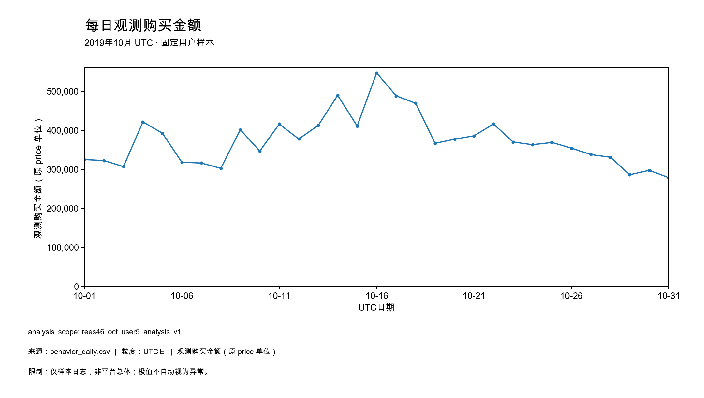
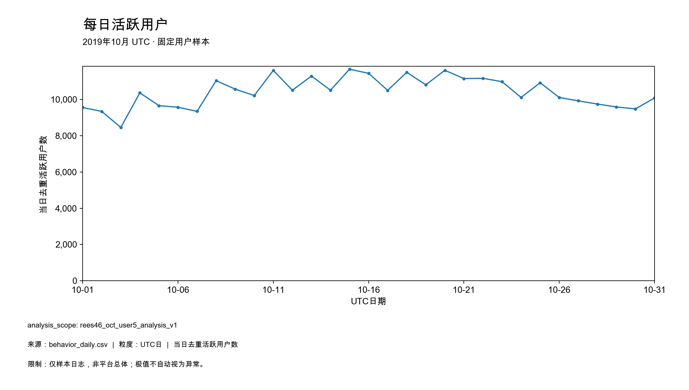
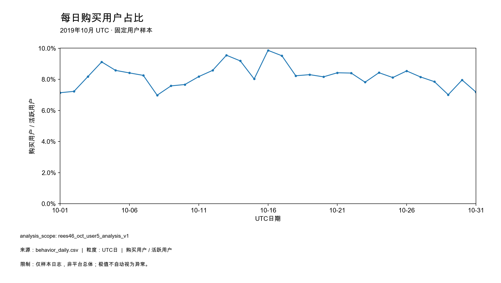
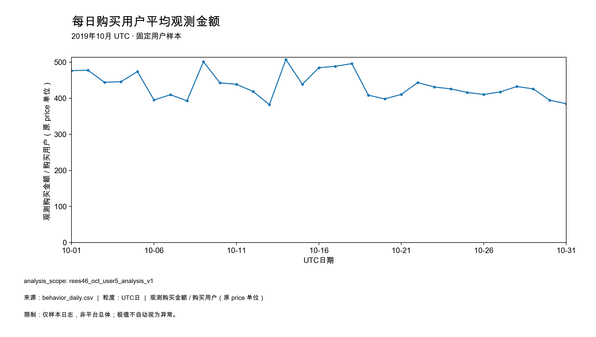
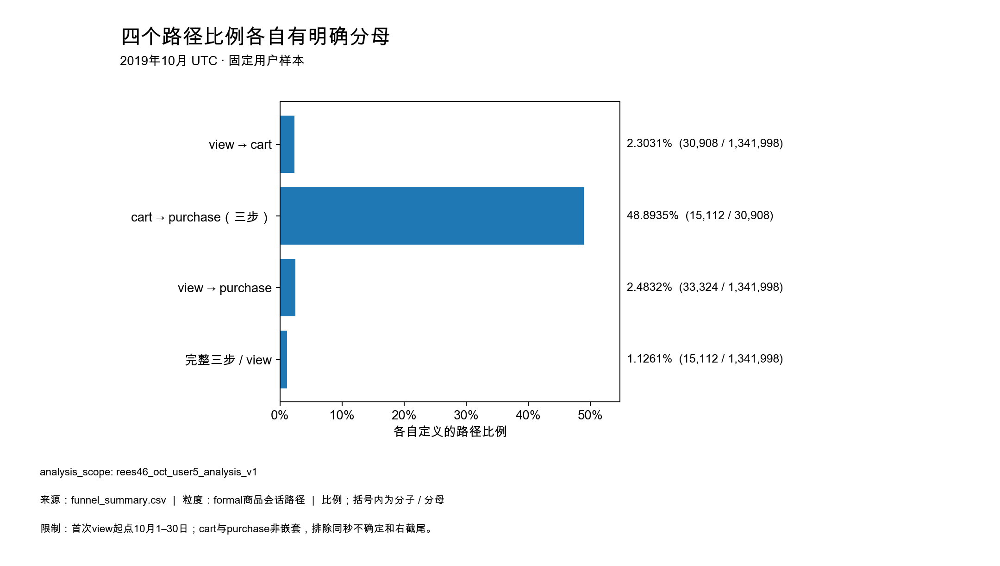
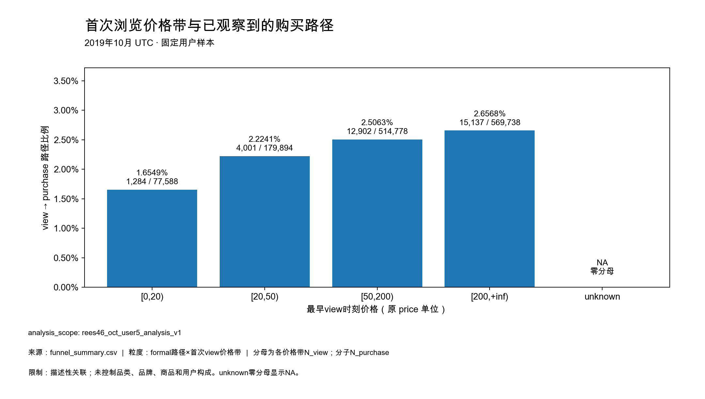
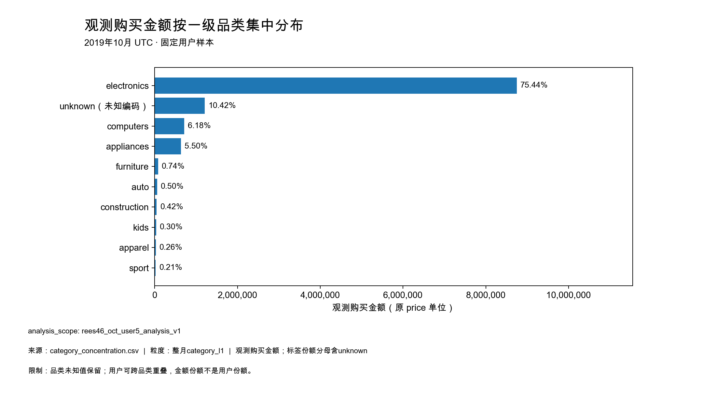
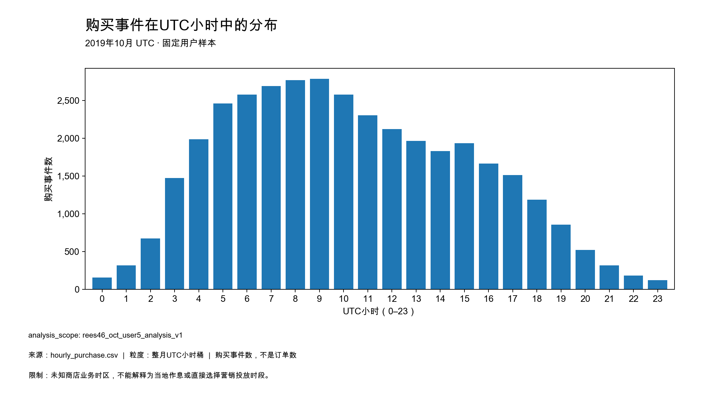

# 10月样本：观测金额集中在electronics，多数路径仅观察到浏览

本期观测购买金额共 **11,598,630.22**（原 price 单位），来自2019年10月固定用户样本日志。月内日金额最高为 **546,884.71（2019-10-16）**，最低为 **278,736.72（2019-10-31）**。这份报告描述当前样本发生了什么，并列出值得核查的结构；不判断原因、异常或策略收益。

- 日金额高点与购买用户占比高点同在10月16日，但活跃用户最高在15日、购买用户平均观测金额最高在14日。多个量的极值并不同步，不能只用流量或购买用户均额代替金额表现。
- 正式可判定路径中，96.34%只有view；view→purchase为2.4832%。这描述24小时、固定复合键内的日志路径，不等于永久流失或用户从未加购。
- electronics占观测金额75.44%，unknown另占10.42%。金额集中与编码覆盖缺口需要一起看，不能把未知部分从分母删除。

## 本期范围和阅读口径

`analysis_scope=rees46_oct_user5_analysis_v1`；2019-10-01至10-31 UTC，固定用户目标抽样概率5%，主口径baseline_keep_all。样本月去重用户151,121、购买用户17,121、购买事件37,019。月人数引用已核验T1.3整月结果，不相加日人数；样本不代表全平台，金额不能乘20外推。所有金额仅为合格日志price之和，不是财务收入、GMV真值或订单收入。

U=当日活跃用户，B=当日购买用户，R=B/U，M=观测购买金额/B，V=观测购买金额。M不是客单价或订单均价。first_seen是观察窗口内首次出现，不是注册或新获客。31天金额状态均为complete_observed，但不能据此证明上游日志绝对无遗漏。

来源分别为已完成的metrics-month-01日/维度表、funnel-month-01脱敏结果，以及从唯一month-v101-01受控读取所得的24行小时汇总。报告未重新计算漏斗或重建指标。定义和固定选数规则见[本轮分析规格](behavior_analysis_contract.md)；技术核验见[验收记录](../docs/t22_validation.md)。

## 1. 金额高点不是所有分量同时到达高点

| 日指标 | 最小值（UTC日） | 最大值（UTC日） | 31日中位数 |
|---|---|---|---|
| U：活跃用户 | 8,453（2019-10-03） | 11,662（2019-10-15） | 10,497 |
| B：购买用户 | 672（2019-10-29） | 1,128（2019-10-16） | 858 |
| 购买事件 | 917（2019-10-29） | 1,635（2019-10-16） | 1,158 |
| V：观测购买金额 | 278,736.72（2019-10-31） | 546,884.71（2019-10-16） | 368,832.94 |
| R：购买用户/活跃用户 | 6.9803%（2019-10-08） | 9.8653%（2019-10-16） | 8.1766% |
| M：观测金额/购买用户 | 382.50（2019-10-13） | 507.40（2019-10-14） | 431.32 |
| 观察期首次出现用户比例 | 32.0865%（2019-10-31） | 100.0000%（2019-10-01） | 39.9429% |

以上为全月固定摘要，极值不标作异常。金额与U/R/M各自使用独立坐标轴、相同UTC日期范围和零基线，避免用双轴制造同步感。精确日值及全部统计见[behavior_daily.csv](behavior_daily.csv)和[behavior_daily_stats.csv](behavior_daily_stats.csv)。

| 金额极值日 | V | U | B | R=B/U | M=V/B |
|---|---|---|---|---|---|
| 2019-10-16 | 546,884.71 | 11,434 | 1,128 | 9.8653% | 484.83 |
| 2019-10-31 | 278,736.72 | 10,079 | 724 | 7.1833% | 385.00 |

V=U×R×M在31天均通过既有容差的一致性检查；这只是口径恒等式，不证明任何分量导致了金额变化。本轮不计算贡献百分比，不推定促销、节日或系统故障。10月1日first_seen比例100%来自窗口左边界，不能解释为当日全部是新客户。

日观测购买金额的范围为278,736.72–546,884.71。来源behavior_daily.csv；UTC日；单位为原price单位；固定用户样本，极值不等于异常。

日活跃用户范围为8,453–11,662。来源behavior_daily.csv；UTC日内去重；不可相加为月用户。

日购买用户占比范围为6.9803%–9.8653%。来源behavior_daily.csv；分母为同日活跃用户；不是路径漏斗。

日购买用户平均观测金额范围为382.50–507.40。来源behavior_daily.csv；分母为同日购买用户；不是订单均价。

## 2. 行为覆盖和有序路径回答不同的问题

| 行为 | 事件记录数 | 发生该行为的整月去重用户 |
|---|---|---|
| cart | 46,472 | 16,751 |
| purchase | 37,019 | 17,121 |
| view | 2,030,590 | 151,116 |

覆盖表回答“是否发生过某行为”，没有验证行为先后；其人数比不能称顺序转化率。本样本未观察到remove_from_cart，没有补造记录。

路径一行是(scope_id,user_id,user_session,product_id)在全月的最早view起点，不是一个人或一个session。正式起点为10月1–30日，所有后续步骤共享24小时截止点；31日事件继续作观察结果。全部1,382,516路径中，40,426条右截尾、92条同秒不确定被单列，剩余1,341,998条formal。两类排除不是流失；缺失路径键的合格事件本次为0，同键无view的192条事件保留在行为覆盖中。

| 独立路径标记 | 数量 |
|---|---|
| n_view | 1,341,998 |
| n_cart | 30,908 |
| n_purchase | 33,324 |
| n_three_step | 15,112 |

| 定义 | 分子/分母 | 比例 |
|---|---|---|
| view→cart | 30,908 / 1,341,998 | 2.3031% |
| cart→purchase（三步） | 15,112 / 30,908 | 48.8935% |
| view→purchase | 33,324 / 1,341,998 | 2.4832% |
| 完整三步比例 | 15,112 / 1,341,998 | 1.1261% |

| 互斥严格类别 | formal路径数 |
|---|---|
| view_cart_purchase | 15,112 |
| view_purchase_no_confirmed_intermediate_cart | 18,212 |
| view_cart_no_observed_purchase | 15,741 |
| view_only | 1,292,933 |

购买后才cart且没有后续purchase的路径，会计入N_cart和N_purchase而不计入三步。本次这类有55条，所以不能通过四个互斥类别简单相加推算所有阶段标记；另有无确认中间cart的购买路径。因此view→purchase可以高于view→cart，图采用四条独立比例而非逐层收窄的传统漏斗。严格类别只描述已观察证据，“无确认中间cart”不等于真实没有加购。

来源funnel_summary.csv整体行；粒度formal商品会话路径；每条柱各自标明分子/分母；UTC起点1–30日，不外推全部访问机会。

### 首次浏览价格带的差异保持描述性解释

| 首次view价格带 | N_view | N_purchase | view→purchase |
|---|---|---|---|
| [0,20) | 77,588 | 1,284 | 1.6549% |
| [20,50) | 179,894 | 4,001 | 2.2241% |
| [50,200) | 514,778 | 12,902 | 2.5063% |
| [200,+inf) | 569,738 | 15,137 | 2.6568% |
| unknown | 0 | 0 | NA |

在当前样本中观察到随首次view价格带变化的描述性差异。尚未控制品类、品牌、商品结构和用户构成，因此不能解释为价格造成转化差异，更不能据此确定调价方案。价格使用最早view时刻，不用购买价；unknown为零分母，显示NA而非0%。

来源funnel_summary.csv价格带行；分母为各桶formal路径数，分子为严格后续购买路径数；UTC，描述性关联，零分母NA。

购买事件审计仍为37,019：无效键0、同键无view 68、早于或同秒于首次view 64、起点不在正式范围928、超过24小时2、符合路径窗口35,957。购买事件保留重复重数，不等于路径或买家；详见[purchase_path_coverage.csv](purchase_path_coverage.csv)。

## 3. 金额集中在electronics，未知品类仍占一成

category_l1共14个桶，金额分母为整月11,598,630.22，包含unknown。Top1 / Top5 / Top10累计金额占比分别为**75.44% / 98.29% / 99.9710%**。Top10指按金额排序的类别桶，含unknown，并非十个完整识别的业务品类。

| 金额排名 | 一级品类/桶 | 观测购买金额 | 购买事件 | 金额占比 |
|---|---|---|---|---|
| 1 | electronics | 8,750,242.89 | 21,184 | 75.4420% |
| 2 | unknown（缺失/非法编码） | 1,209,130.91 | 8,720 | 10.4248% |
| 3 | computers | 716,624.99 | 1,490 | 6.1785% |
| 4 | appliances | 637,868.32 | 3,515 | 5.4995% |
| 5 | furniture | 86,128.03 | 401 | 0.7426% |
| 6 | auto | 58,192.89 | 464 | 0.5017% |
| 7 | construction | 48,659.98 | 416 | 0.4195% |
| 8 | kids | 34,322.77 | 260 | 0.2959% |
| 9 | apparel | 29,677.05 | 386 | 0.2559% |
| 10 | sport | 24,422.29 | 91 | 0.2106% |

unknown的观测金额为1,209,130.91（10.4248%），对应8,720条购买事件；这一金额没有删除或重分配。electronics占比说明本样本的日志金额结构集中，尚不能判断集中风险已经发生，也不能认为某品类有问题。

收尾授权后，已直接从合格事实按整月重新去重；users/buyers为月内去重用户/购买用户，原user_days/buyer_user_days仍保留。各品类用户集合相互重叠，不能把品类users相加当全月151,121名用户，也不能把每日用户相加当月人数。金额与事件可加总，人数的粒度必须单独说明。

| 金额排名 | 品类/桶 | 月去重users | 月去重buyers | 用户日user_days | 购买用户日buyer_user_days |
|---|---|---|---|---|---|
| 1 | electronics | 84,077 | 9,902 | 156,714 | 15,196 |
| 2 | unknown | 75,652 | 5,201 | 131,131 | 6,886 |
| 3 | computers | 12,261 | 816 | 19,217 | 1,111 |
| 4 | appliances | 27,112 | 2,367 | 41,373 | 2,923 |
| 5 | furniture | 9,983 | 272 | 13,629 | 337 |
| 6 | auto | 7,950 | 331 | 11,046 | 399 |
| 7 | construction | 5,033 | 276 | 6,943 | 345 |
| 8 | kids | 4,945 | 173 | 6,421 | 215 |
| 9 | apparel | 12,850 | 267 | 16,345 | 322 |
| 10 | sport | 2,023 | 49 | 2,496 | 63 |

unknown月去重用户75,652、月去重购买用户5,201，与其他品类一样参与去重。electronics的月用户84,077与逐日用户相加156,714不同，月买家9,902与逐日买家相加15,196也不同；差异体现跨日重叠，不是用户异常。完整14桶见[全类别CSV](category_concentration.csv)，金额排名及Top1/5/10份额保持原值。

来源category_concentration.csv；整月category_l1金额；占比分母包含unknown；UTC固定样本。unknown排名第二，未移出Top10。

## 4. 购买事件峰值在UTC 9时，不能解释为本地作息

| UTC小时极值 | 购买事件 | 占37,019购买事件 | 小时内去重购买用户 | 观测购买金额 |
|---|---|---|---|---|
| 9 | 2,788 | 7.5313% | 2,011 | 908,177.91 |
| 23 | 125 | 0.3377% | 95 | 39,416.45 |

小时0–23完整分布的事件合计37,019、金额合计11,598,630.22，与月主口径一致。小时购买用户只在各自小时内去重，不能相加为月买家。最高/最低仅描述UTC桶，没有站点业务时区，不能把峰值直接解释为当地上午/晚上，也不足以提出营销投放时间建议。完整小时表见[hourly_purchase.csv](hourly_purchase.csv)。

来源hourly_purchase.csv；分母为全月37,019条购买事件（份额在CSV）；横轴UTC小时；行为事件不是订单，未知业务时区。

## 证据与尚未回答的问题

本轮固定日、首次view价格带、category_l1、UTC小时四种切片，没有继续搜索品牌/商品排行、用户聚类或星期几来凑故事。八张图直接读取提交CSV；日/品类/小时对账、独立标准库算术及逐图检查见[验收记录](../docs/t22_validation.md)。旧事实、指标、漏斗和历史报告未改写。

值得进一步核查的问题限于：日金额极值在质量与历史基准下是否值得继续诊断；只观察到view及无确认中间cart的路径是否与商品/用户构成或记录覆盖有关；electronics金额集中和unknown覆盖分别会怎样影响后续解释。这些是待核查问题，不是已确认原因或业务方案。简短业务阅读版见[阶段总结](period_summary.md)。本轮不执行T2.3、正式异动检测、贡献拆解或实验。
