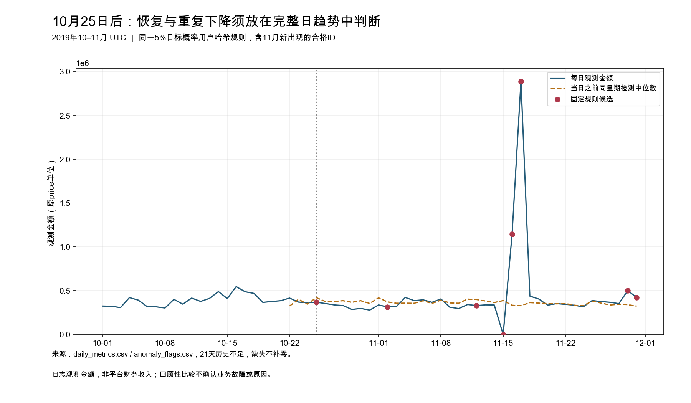
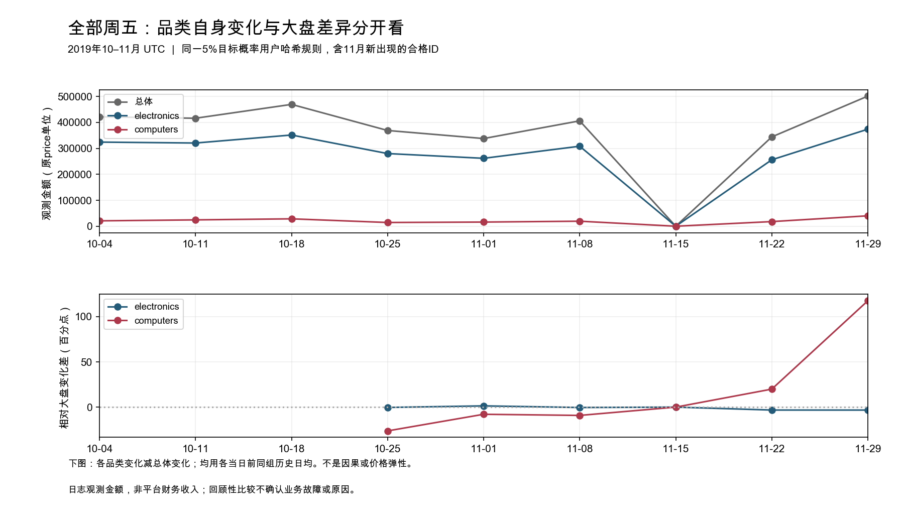
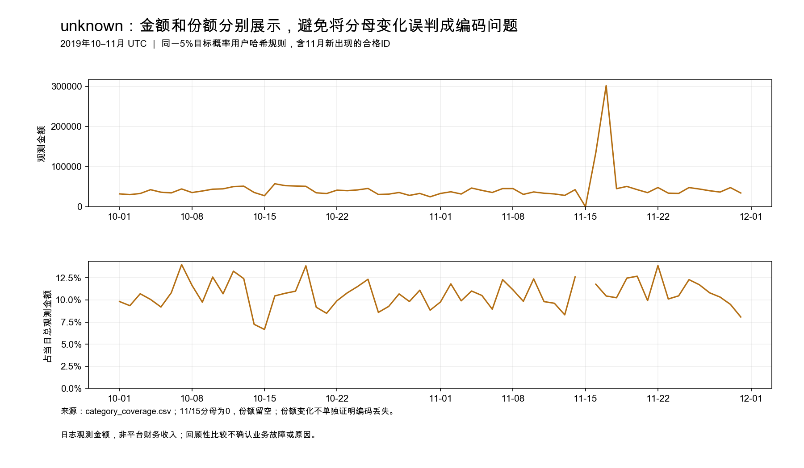

# 10–11月复核：先核对11月15–17日购买记录，再查computers商品构成

**保留原判断：不直接调价、改流量或追加优惠；10月25日的金额下降和当时的拆解仍成立。修改的是核查顺序：electronics主要承载大盘波动，不能因金额贡献最大就视为额外恶化的重点；computers更值得品类定向取证。但当前最高优先是对账11月15–17日的总体purchase事件覆盖与时间记录，再解释后续恢复。** 11月15日有活跃和浏览/加购记录却无purchase，随后两天金额集中放大；现有日志不能确认这是实际交易变化、延迟记录还是其他原因。

本报告是独立双月范围`rees46_oct_nov_user5_analysis_v1`。十月仍复用`metrics-month-01`，旧[案例](case_observed_change.md)、scope、指标和收据未改写；只补同一商店11月的固定5%目标概率用户样本。月份不进入用户哈希，11月新出现且符合规则的ID可以入选，不是十月用户回访队列。所有金额均为日志price观测和，purchase事件不是订单；不外推平台财务收入。

## 1. 25日后有恢复迹象，但不是一次下跌后稳定恢复

10月25日金额368,832.94，相对原检测中位数421,496.80下降12.49%；原历史日期仍是10月4、11、18日，不用11月改写其事前基线。

完整日趋势显示，10月26–31日金额均低于25日，31日为278,736.72；11月1日337,739.31，尚无稳定恢复。11月4日回到422,823.90，8日405,944.06：8日较原十月检测中位数仍低3.69%，但高于它当时滚动历史中位数3.45%，可称恢复迹象。之后11月22日344,057.94再次低于原十月中位数18.37%，29日501,273.12又高18.93%。**既不是持续单向下降，也不能宣称一次事故已经修复。**

以下保留10月4日起全部9个周五，早期历史不足不补计算，11月15日也不因“不好解释”而删除。

| UTC日期 | 总金额 | electronics金额 / 份额 | computers金额 / 份额 | 总体变化¹ | electronics变化¹ | computers变化¹ |
|---|---:|---:|---:|---:|---:|---:|
| 10-04 | 421,496.80 | 324,083.38 / 76.89% | 20,727.03 / 4.92% | — | — | — |
| 10-11 | 415,980.94 | 320,498.11 / 77.05% | 24,429.44 / 5.87% | — | — | — |
| 10-18 | 469,326.45 | 351,360.53 / 74.86% | 28,486.31 / 6.07% | — | — | — |
| 10-25 | 368,832.94 | 279,924.74 / 75.89% | 14,333.89 / 3.89% | −15.33% | −15.68% | −41.61% |
| 11-01 | 337,739.31 | 261,581.25 / 77.45% | 15,993.69 / 4.74% | −19.38% | −17.99% | −27.28% |
| 11-08 | 405,944.06 | 308,172.45 / 75.92% | 19,322.34 / 4.76% | +2.00% | +1.59% | −7.15% |
| 11-15 | 0.00 | 0.00 / 不适用 | 0.00 / 不适用 | −100.00% | −100.00% | −100.00% |
| 11-22 | 344,057.94 | 255,915.18 / 74.38% | 17,826.32 / 5.18% | +23.70% | +20.48% | +43.62% |
| 11-29 | 501,273.12 | 373,787.23 / 74.57% | 40,107.82 / 8.00% | +84.34% | +81.08% | +201.89% |

¹这三列使用每个当日前7/14/21/28日中合格历史日期的**各自日均金额**，不是检测中位数；至少3点。11月22、29日的四个历史周五均包含15日的日志零购买，均值被拉低，不能把正增长直接当作恢复幅度。图中同时保留实际金额与按当日前历史计算的相对差，不更换窗口或删除零值以改善故事。完整精度见[周五对照](cross_period/friday_comparisons.csv)。

## 2. electronics体量大；computers的相对弱势更值得核对，但不单向持续

旧贡献表复读确认：25日electronics自身下降15.68%，总体均值口径下降15.33%，只低于大盘**0.35个百分点**；其份额76.21%→75.89%，下降0.32个百分点。它贡献77.96%的净金额差，主要因为原本基数大。computers自身下降41.61%，低于大盘**26.28个百分点**，份额5.64%→3.89%；这是不同的问题，不能用贡献排名代替相对表现。

11月1日electronics反而比大盘变化高1.39个百分点，8日只低0.41个百分点。computers同期分别低7.91、9.16个百分点，说明25日的相对偏弱并非只出现一次。固定规则下，11月computers有22/30天低于自身历史均值，19/30天的变化幅度低于同日期大盘；electronics对应15/30、11/30天。它们是完整观察范围内的描述计数，不是独立显著性检验；上涨较慢也可能表现为“低于大盘”，不一概称金额下降。

11月29日computers升至40,107.82、份额8.00%，超出此前三个十月周五的自身均值；因此不能定性持续衰退。月度也须校正天数：

| 范围 | 10月31日日均金额 | 11月30日日均金额 | 日均变化 | 月金额份额：10月→11月 |
|---|---:|---:|---:|---:|
| 总体 | 374,149.36 | 462,614.62 | +23.64% | 100%→100% |
| electronics | 282,265.90 | 345,303.69 | +22.33% | 75.44%→74.64% |
| computers | 23,116.94 | 25,165.50 | +8.86% | 6.18%→5.44% |
| unknown | 39,004.22 | 49,726.39 | +27.49% | 10.42%→10.75% |

月均显示computers增长弱于总体，但11月16–17日两天占全月金额**29.09%**、购买事件**27.46%**，不能把+23.64%写成典型日稳定改善。没有删除这两天或另找一个更有利的月度窗口。[月度完整表](cross_period/monthly_daily_means.csv)

## 3. 11月重复出现候选变化，最先要区分日志形态与业务变化

11月30天均有足够历史，沿用旧阈值，得到3个向下、4个向上候选，其余23天未命中；未命中不等于业务正常。全61天筛选结果[逐日保留](cross_period/anomaly_flags.csv)。

| 日期 | 观测金额 | 相对当日前同星期中位数 | score |
|---|---:|---:|---:|
| 11-02 | 314,406.36 | −15.53% | −3.32 |
| 11-12 | 330,430.85 | −17.17% | −3.18 |
| 11-15 | 0.00 | −100.00% | −7.66 |
| 11-16 | 1,144,912.53 | +242.42% | +25.66 |
| 11-17 | 2,892,482.47 | +780.49% | +83.38 |
| 11-29 | 501,273.12 | +47.04% | +3.17 |
| 11-30 | 422,523.92 | +30.31% | +5.93 |

11月15日的18,981名活跃用户、310,916条事件与**零购买用户/事件**形成待核查断点；16日有3,372条购买、金额1,144,912.53，17日有9,138条、金额2,892,482.47。这不是金额解析失败：全月购买价格均合法、非负且非零，原始/派生字段和重复重数独立核验通过。15日依据原规则标`no_purchases`，日志内金额为结构零，M因买家分母为0留空；它仍**不能证明真实交易为0或上游没有漏记**。

可能是实际购买节奏变化，也可能涉及购买日志缺失、延迟或事件日期；还可能有商品/用户组合集中。现有日汇总无法区分，不能断言促销、库存、支付故障或修复。新增月份改变了证据优先级：仅拿后两天峰值“证明恢复”会忽视最需要对账的断点。

## 4. unknown没有被删除，也不能单独解释这段变化

双月已知品类覆盖（按整月可加总计数/金额计算）分别为：事件68.34%→67.84%，购买事件76.44%→74.97%，金额89.58%→89.25%。unknown日均金额增加27.49%，份额仅增加0.32个百分点；总量同样保留它，不把其增长等同于已知品类金额被改标签。

15日所有品类购买都为0，unknown购买金额份额因分母为0是“不适用”，不是0%覆盖缺口。16、17日unknown金额134,801.37、302,004.30，金额份额11.77%、10.44%；其峰值也伴随大盘放大。覆盖限制electronics/computers的归类解释，但目前没有证据把整体断点归因为品类编码丢失。非空但不符合冻结category格式的11月样本记录实测为0，缺失仍进入unknown；原始缺失并不因此消失。

## 5. 下一步取证顺序与改变建议的条件

**最高优先：核对11月14–18日、重点15–17日的总体purchase记录与交易侧时间对账。** 需要事件产生/入库时间、分批上传/补发记录、同范围交易侧逐日控制总数，以及可连接的商品ID与事件标识（若可获得）。先确定15日零purchase、16–17日峰值是实际发生日期还是记录/采集口径造成；只比“当天有日志”不足以完成核查。

若交易侧确认15日有交易而发布日志没有对应记录，或16–17日含延迟回填，则优先修正该段观察覆盖与基准解释，不把峰值当业务恢复；本轮不删除或重分配事件。若事件时间与交易侧一致且覆盖可信，再查16–17日SKU购买次数、观测价格与金额贡献，确认峰值是否集中于少数商品/记录；不能只增加后续月份将其“稀释”。这些交易、入库和库存/渠道证据目前未获得。

**随后优先computers，而非仅因electronics体量大先调整它。** 聚焦10月25日、11月1日、8日，对照各自固定历史周五；样本中的computers购买事件仅38、40、51条，原十月4/11/18日为51、56、59条。需要同SKU的购买次数、价格、可售/缺货状态和有效期category映射，区分商品组合、少数购买记录波动与同商品内变化。若少量SKU/记录主导差额，下一轮可针对这些日期核查商品或在授权后扩大用户样本，暂不将相对偏弱外推全平台；若同SKU、覆盖一致后仍反复下降，再定向查可售、支付或触达。electronics保留总体金额对账，不优先开展全商品价格扫描。

**当前决定仍是暂不直接改变价格、流量或优惠策略。** 新证据改变了核查顺序，没有提供因果结论、收益估计或上线依据；不将该公开日志写成Temu真实事故。

## 方法与证据范围

规则在读取11月业务结果前固定于[配置](../config/cross_period.yaml)及[来源/范围说明](../docs/cross_period_source_scope.md)：仅purchase_amount筛选，过去7/14/21/28天≥3点，median/MAD、scale=1.4826×MAD，|score|>3且相对幅度≥10%。阈值不代表统计显著性或公司告警标准；无业务币种/损失容忍依据，不引入商业绝对损失阈值。历史不足、零基线、MAD=0与质量阻断均有状态，不补零、不给分母加极小数。原十月31天筛选数值逐项不变。

品类自身比较使用同组历史日均；与大盘差是变化百分比之差，不是金额贡献份额，也不是因果效应。只比较electronics/computers及必要unknown背景，未搜索新商品、品牌或渠道切片；不计算first_seen，不重新划用户队列。

十月2,114,081条事件复用既有指标；11月固定用户候选3,340,951条、184,855原始ID，形成30行日指标和420行品类日指标。合并为61行日表、853行品类表的明确结果集合，未合并两个十月复验run。日用户/买家不能相加为双月人数。[完整日指标](cross_period/daily_metrics.csv)包含U/B/V、购买事件、R/M及质量状态；[全部品类日表](cross_period/category_daily.csv)、[品类同历史比较](cross_period/category_comparisons.csv)、[每日覆盖](cross_period/category_coverage.csv)、[简短验收](../docs/cross_period_validation.md)可复查。
